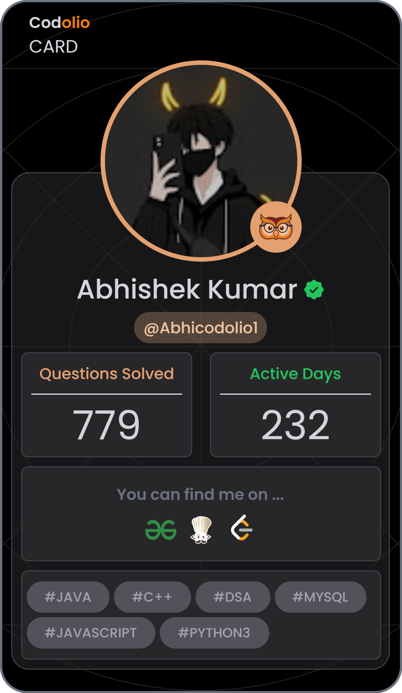

<!-- ┌─────────────────────────────────────────────────────────────────┐ -->
<!-- │                  ABHISHEK KUMAR · GitHub Profile                  │ -->
<!-- └─────────────────────────────────────────────────────────────────┘ -->

<div align="center">


<a href="https://github.com/Abhishek-k03">
  
</a>

<br/>

<a href="https://www.linkedin.com/in/abhishek312/"></a>&nbsp;
<a href="https://codolio.com/profile/Abhicodolio1"></a>&nbsp;
<a href="mailto:abhi3122004ak@gmail.com"></a>&nbsp;
<a href="https://github.com/Abhishek-k03"></a>

</div>


## &nbsp;👋&nbsp; About Me

I'm a **final-year Computer Science** student at **IIIT Sonepat** drawn to the parts of software most people skip — the storage layer, the request lifecycle, the retrieval step that decides whether an answer is grounded or made up.

&nbsp;&nbsp;**🐍 &nbsp;Backend, deep** — Python with **FastAPI** and **Django**. I once wrote a graph engine with its own binary on-disk format and a write-ahead log, just to understand durability properly.

&nbsp;&nbsp;**🤖 &nbsp;AI systems, end to end** — RAG pipelines, vector search, LLM orchestration, and the web automation that feeds them.

&nbsp;&nbsp;**🧠 &nbsp;ML, hands-on** — computer vision (CNNs for medical imaging & detection) and NLP (text classification, embeddings).

&nbsp;&nbsp;**🧩 &nbsp;Algorithms, seriously** — LeetCode **Knight (1917)**, CodeChef **3★**, ~780 problems across platforms.

> *I care less about chasing frameworks and more about understanding what's underneath them.*

## &nbsp;🎯&nbsp; Current Focus

```yaml
shipping:    swagger2drawio   # a published PyPI CLI: OpenAPI → draw.io diagrams
building:    Scrybe           # self-building RAG knowledge base, answers with citations
going_deep:  systems          # storage engines, WAL durability, mmap traversal
sharpening:  DSA              # contest consistency on LeetCode & CodeChef
exploring:   [ LLM orchestration, vector retrieval, async FastAPI at scale ]
```

## &nbsp;🛠️&nbsp; Tech Stack

<div align="center">
<table>
<tr>
<td align="right" width="150"><sub><b>LANGUAGES</b></sub></td>
<td></td>
</tr>
<tr>
<td align="right"><sub><b>BACKEND</b></sub></td>
<td></td>
</tr>
<tr>
<td align="right"><sub><b>FRONTEND</b></sub></td>
<td></td>
</tr>
<tr>
<td align="right"><sub><b>AI / ML</b></sub></td>
<td>    </td>
</tr>
<tr>
<td align="right"><sub><b>DATABASES</b></sub></td>
<td></td>
</tr>
<tr>
<td align="right"><sub><b>TOOLS</b></sub></td>
<td>  </td>
</tr>
</table>
</div>

## &nbsp;🚀&nbsp; Featured Projects

<table>
<tr>
<td width="50%" valign="top">

#### &nbsp;📦&nbsp; [swagger2drawio](https://github.com/Abhishek-k03/swagger2drawio)
###### Published on PyPI · OpenAPI → draw.io, with diffing

A Python CLI that turns OpenAPI 3.x / Swagger 2.0 specs into clean, editable draw.io diagrams — endpoint trees, ER-style schema maps, and a green/red/yellow **diff** between two spec versions.

`Python` `CLI` `OpenAPI` `CI` `MIT`

`▹` Live on **PyPI** — `pip` / `uvx` installable
`▹` Resolves multi-file & remote `$ref`s, handles cycles
`▹` Bundled themes + pluggable layout entry points

[**`→ Repo`**](https://github.com/Abhishek-k03/swagger2drawio) &nbsp; [**`→ PyPI`**](https://pypi.org/project/swagger2drawio/)

</td>
<td width="50%" valign="top">

#### &nbsp;🧱&nbsp; [OffsetGraph](https://github.com/Abhishek-k03/OffsetGraph)
###### A graph engine built from the bytes up

A Python graph engine with **deterministic binary storage**, pointer-based adjacency traversal, and **WAL crash recovery** with idempotent replay — across in-memory, disk-backed, and mmap modes.

`Python` `FastAPI` `mmap` `WAL` `LRU`

`▹` Fixed-width binary records, stable byte offsets
`▹` Write-ahead log + recovery pipeline on startup
`▹` Benchmark runner comparing traversal strategies

[**`→ Repo`**](https://github.com/Abhishek-k03/OffsetGraph)

</td>
</tr>
<tr>
<td width="50%" valign="top">

#### &nbsp;📚&nbsp; [Scrybe](https://github.com/Abhishek-k03/Scrybe)
###### A knowledge base that cites its sources

Point it at URLs and files; it scrapes, chunks, embeds, and stores everything in a vector store — then answers through a chat UI **grounded with clickable citations**.

`FastAPI` `React` `ChromaDB` `Playwright` `Groq`

`▹` Headless Chromium ingestion via Playwright
`▹` Jina v3 embeddings + ChromaDB vector search
`▹` Persisted chats, llama-3.3-70b answers

[**`→ Repo`**](https://github.com/Abhishek-k03/Scrybe)

</td>
<td width="50%" valign="top">

#### &nbsp;⚡&nbsp; [Taskflow](https://github.com/Abhishek-k03/Taskflow)
###### Real-time task scheduling, end to end

A scheduling & execution system with a Next.js dashboard — create tasks, configure cron-based periodic jobs, and watch status update **live over WebSockets**.

`Next.js 16` `TypeScript` `WebSocket` `FastAPI`

`▹` Real-time metrics & task status via WebSocket
`▹` Periodic jobs configured with cron expressions
`▹` Type-safe App Router UI, responsive by design

[**`→ Repo`**](https://github.com/Abhishek-k03/Taskflow)

</td>
</tr>
</table>

<details>
<summary><b>&nbsp;More projects worth a look →</b></summary>
<br/>

| Project | What it is | Stack |
|---|---|---|
| [**nexusRAG-qa-system**](https://github.com/Abhishek-k03/nexusRAG-qa-system) | RAG QA that grounds answers strictly in retrieved passages | Python · RAG · Vector search |
| [**Smart-Scraper**](https://github.com/Abhishek-k03/Smart-Scraper) | Scrape → clean → LLM-parse into structured data | FastAPI · React · Groq · Ollama |
| [**Brain-Tumor-Detection-using-CNN**](https://github.com/Abhishek-k03/Brain-Tumor-Detection-using-CNN) | CNN classifier for MRI tumor detection | PyTorch · CV |
| [**Face-mask-detection**](https://github.com/Abhishek-k03/Face-mask-detection) | Real-time mask detection pipeline | OpenCV · CV |
| [**sms-spam-classifier**](https://github.com/Abhishek-k03/sms-spam-classifier) | NLP text classifier on raw + processed data | scikit-learn · NLP |
| [**Soil_Classification_annam**](https://github.com/Abhishek-k03/Soil_Classification_annam) | ML competition soil-type classifier | Jupyter · ML |

</details>

## &nbsp;🤖&nbsp; AI / ML Highlights

<div align="center">

| Domain | Where I've worked on it |
|:--|:--|
| 🧠 &nbsp;**RAG & LLM Systems** | Scrybe · nexusRAG — chunking, embeddings, retrieval, grounded answers with citations |
| 👁️ &nbsp;**Computer Vision** | Brain Tumor CNN · Face-mask detection — medical imaging & real-time detection |
| 💬 &nbsp;**NLP** | SMS spam classification · embedding-based retrieval |
| 📊 &nbsp;**Applied ML** | Soil classification (competition) · end-to-end ML pipelines |
| 🔗 &nbsp;**Orchestration** | LangChain · Groq · Ollama · ChromaDB · Jina embeddings |

</div>

## &nbsp;🏆&nbsp; Competitive Programming

<table>
<tr>
<td width="40%" valign="middle" align="center">



</td>
<td width="60%" valign="middle">

<table>
<tr>
<td align="center" width="50%">

###### LEETCODE
# 1917
**Knight** · peak 1949
38 contests

</td>
<td align="center" width="50%">

###### CODECHEF
# 1608
**3★** · peak 1608
6 contests

</td>
</tr>
</table>

**662 DSA problems** &nbsp;·&nbsp; `279 Easy` · `340 Medium` · `43 Hard`
**~780 total** across platforms &nbsp;·&nbsp; **232** active days &nbsp;·&nbsp; **44** contests

`Arrays` `Dynamic Programming` `Graphs · DFS/BFS` `HashMaps` `Two Pointers`

<a href="https://codolio.com/profile/Abhicodolio1"></a>

</td>
</tr>
</table>

## &nbsp;📊&nbsp; GitHub Analytics

<div align="center">


</div>

## &nbsp;📫&nbsp; Let's Connect

<div align="center">

<a href="https://github.com/Abhishek-k03"></a>
<a href="https://www.linkedin.com/in/abhishek312/"></a>
<a href="mailto:abhi3122004ak@gmail.com"></a>
<a href="https://codolio.com/profile/Abhicodolio1"></a>
<a href="https://www.abhishek-k.me/"></a>

</div>


