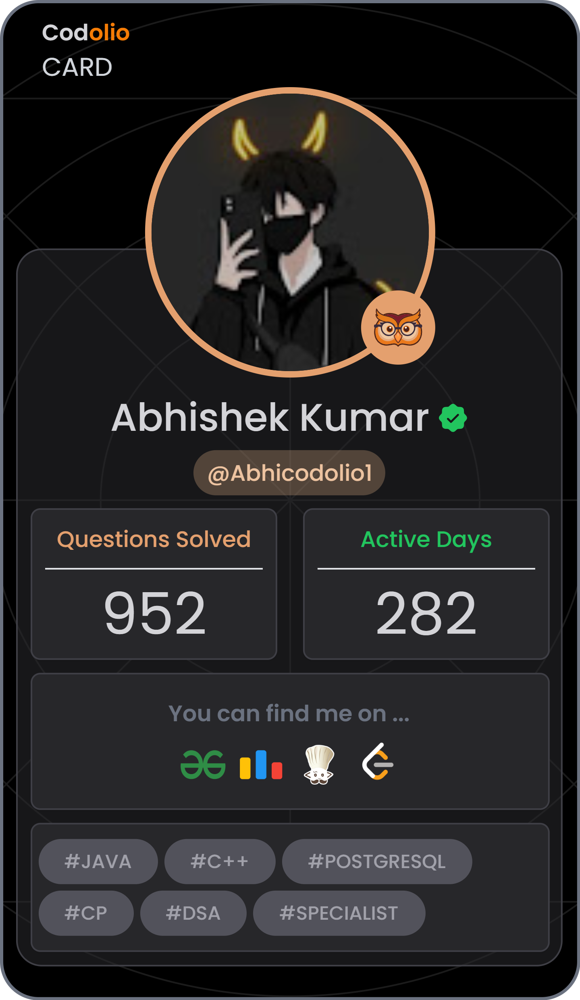
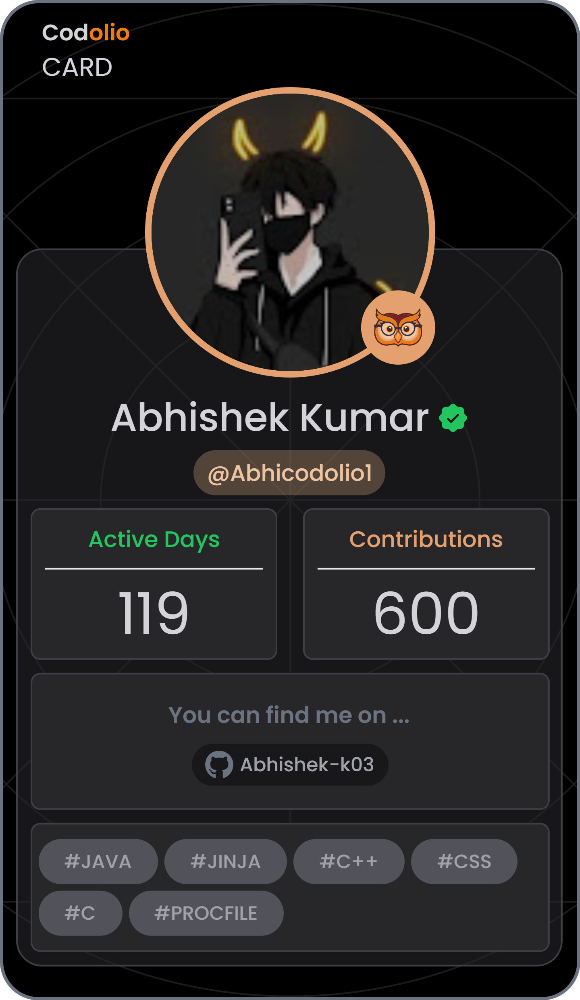

<!-- Abhishek Kumar · GitHub Profile README -->

# Abhishek Kumar

**Backend Engineering · Systems · AI**

 

---

Final-year CS student at **IIIT Sonepat**, working mostly in **Python and C++**.

I build backend and systems software, and I tend to want to understand the layer underneath the one I'm using — which is how I ended up writing a C++20 limit order book that matches at millions of orders per second, and a graph engine with its own binary on-disk format and write-ahead log instead of reaching for a database. I've also shipped [`swagger2drawio`](https://github.com/Abhishek-k03/swagger2drawio) to PyPI, and I compete regularly — **LeetCode Knight**, ~900 problems solved.

## Projects

**[TradeXchange](https://github.com/Abhishek-k03/TradeXchange)** — *a limit order book matching engine with a C++20 core*
Strict price-time priority matching benchmarked at **2.6M limit-order inserts/sec, p50 200 ns / p99 800 ns**. A FastAPI gateway packs orders into 32-byte C-aligned binary structs and pipes them over ZeroMQ, so the engine reads them straight into memory with no deserialization step.
`C++20` · `ZeroMQ` · `FastAPI` · `React` · `Low latency`

**[OffsetGraph](https://github.com/Abhishek-k03/OffsetGraph)** — *a graph engine written from the bytes up*
Fixed-width binary records with stable byte offsets, a write-ahead log with idempotent crash replay, and pointer-based traversal across in-memory, disk-backed, and mmap modes.
`Python` · `mmap` · `WAL` · `Storage internals`

**[Scrybe](https://github.com/Abhishek-k03/Scrybe)** — *a knowledge base that cites its sources*
Point it at URLs or files; it scrapes, chunks, and embeds them into a vector store, then answers through a chat UI grounded with clickable citations.
`FastAPI` · `React` · `ChromaDB` · `Playwright` · `Groq`

**[Taskflow](https://github.com/Abhishek-k03/Taskflow)** — *real-time task scheduling, end to end*
Scheduling and execution service with cron-configured periodic jobs and a dashboard that streams task status and metrics live over WebSockets.
`FastAPI` · `Next.js` · `TypeScript` · `WebSockets`

## Tech Stack

<table>
<tr>
<td align="right" width="130"><b>CORE</b></td>
<td></td>
</tr>
<tr>
<td align="right"><b>BACKEND</b></td>
<td> </td>
</tr>
<tr>
<td align="right"><b>AI / ML</b></td>
<td>  </td>
</tr>
<tr>
<td align="right"><b>TOOLING</b></td>
<td></td>
</tr>
</table>

## Coding Profile

## GitHub Stats

