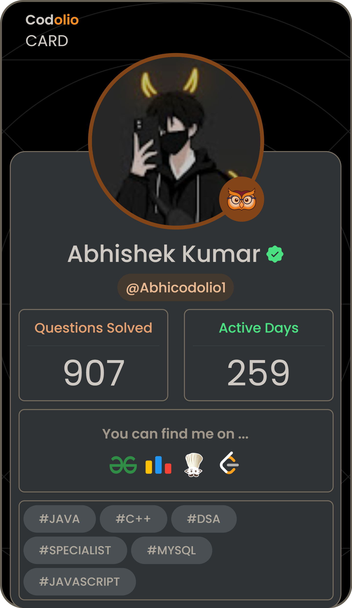

<!-- Abhishek Kumar · GitHub Profile -->

# Abhishek Kumar

<b>Backend Engineering&nbsp; ·&nbsp; AI Systems&nbsp; ·&nbsp; Applied Machine Learning</b>

Final-year Computer Science @ IIIT Sonepat — engineering durable backend 
infrastructure and AI systems that stay grounded in real sources.

&nbsp;
&nbsp;
&nbsp;

## About

I'm a final-year Computer Science student at **IIIT Sonepat** interested in backend engineering, AI systems, and machine learning.

**Backend.**  Python, FastAPI, and Django. Built a graph engine with a custom binary storage format and write-ahead logging to understand storage internals.

**AI systems.**  Experience building RAG pipelines, vector search, LLM-based applications, and automation workflows.

**Machine learning.**  Worked on computer vision and NLP projects, including CNNs, text classification, and embeddings.

**Problem solving.**  LeetCode Knight (**1949** peak), CodeChef **3★**, Codeforces Specialist (**1585** peak), with **900+** problems solved.

## Current Focus

|                |                                                       |
| -------------- | ----------------------------------------------------- |
| **Shipping**   | `swagger2drawio` — OpenAPI → draw.io CLI (PyPI)       |
| **Building**   | `Scrybe` — Self-building RAG knowledge base           |
| **Learning**   | Storage engines, WAL, memory mapping                  |
| **Practicing** | LeetCode, CodeChef, Codeforces                        |
| **Exploring**  | LLM orchestration, vector retrieval, scalable FastAPI |

## Tech Stack

<table>
<tr>
<td align="right" width="150"><b>LANGUAGES</b></td>
<td></td>
</tr>
<tr>
<td align="right"><b>BACKEND</b></td>
<td></td>
</tr>
<tr>
<td align="right"><b>FRONTEND</b></td>
<td></td>
</tr>
<tr>
<td align="right"><b>AI / ML</b></td>
<td>    </td>
</tr>
<tr>
<td align="right"><b>DATABASES</b></td>
<td></td>
</tr>
<tr>
<td align="right"><b>TOOLS</b></td>
<td>  </td>
</tr>
</table>

## Featured Projects

| Project                   | Description                                                          | Stack                      |
| ------------------------- | -------------------------------------------------------------------- | -------------------------- |
| **[swagger2drawio](...)** | OpenAPI → draw.io CLI published on PyPI with spec diffing.           | Python · CLI · OpenAPI     |
| **[OffsetGraph](...)**    | Graph engine with binary storage, WAL recovery, and mmap traversal.  | Python · Systems           |
| **[Scrybe](...)**         | RAG knowledge base with citations, vector search, and web ingestion. | FastAPI · React · ChromaDB |
| **[Taskflow](...)**       | Real-time task scheduler with cron jobs and WebSocket updates.       | FastAPI · Next.js          |

## AI / ML

| Domain                | Where I've worked on it                                                              |
| :-------------------- | :----------------------------------------------------------------------------------- |
| **RAG & LLM systems** | Scrybe · nexusRAG — chunking, embeddings, retrieval, grounded answers with citations |
| **Computer vision**   | Brain Tumor CNN · Face-mask detection — medical imaging & real-time detection        |
| **NLP**               | SMS spam classification · embedding-based retrieval                                  |
| **Applied ML**        | Soil classification (competition) · end-to-end ML pipelines                          |
| **Orchestration**     | LangChain · Groq · Ollama · ChromaDB · Jina embeddings                               |

## Competitive Programming

<table>
<tr>
<td width="40%" align="center" valign="top">

</td>
<td width="60%" valign="top">

 

<table>
<tr>
<td align="center" width="33%%">

<b>LEETCODE</b>

### 1899

Knight · peak 1949
42 contests

</td>
<td align="center" width="33%%">

<b>CODECHEF</b>

### 1608

3★ · peak 1608
7 contests

</td>
<td align="center" width="33%%">

<b>CODEFORCES</b>

### 1585

Specialist · peak 1585
6 contests

</td>
</tr>
</table>

**~900 problems solved** across platforms
**259 active days** &nbsp;·&nbsp; **54 contests**

`Arrays` `Dynamic Programming` `Graphs` `HashMaps` `Two Pointers`

</td>
</tr>
</table>

## GitHub Stats

## Contact

 

